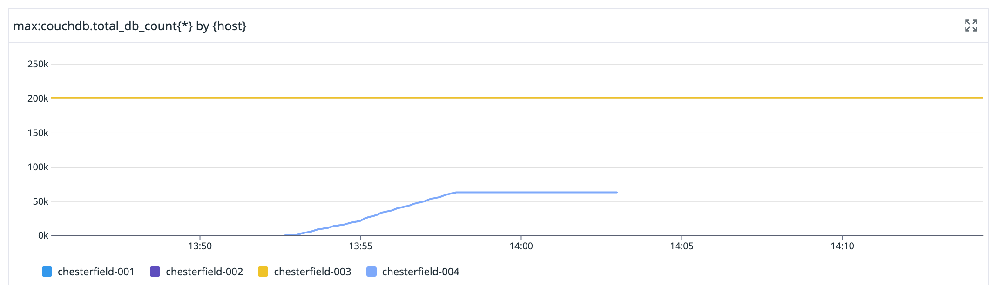

+++
author = "Sam Rose"
date = 2024-01-15T00:00:00Z
description = "What happened to cause the Budibase Cloud incident on January 9th, and what we're doing to prevent it happening again."
image = ""
images = []
profilePic = "https://samwho.dev/images/me.jpg"
title = "Budibase Cloud January 9th Incident"
+++

On January 9th, the ability to log in to Budibase Cloud was severely degraded
for a subset of our customers. We were able to trace this problem back to data
corruption in our production database, and resolved the problem by rolling our
database back to a known-good snapshot. The snapshot we rolled back to, at the
time we rolled back to it, was 104 minutes old. Any changes made by customers on
Budibase Cloud in those 104 minutes were lost.

We regret that we had to do this, and apologise for the inconvenience it has
caused our customers. This post is going to discuss in detail how this came to
happen, and what we’re doing to prevent it from happening again.

# What happened

As part of our ongoing work to make Budibase Cloud a more stable and fast
environment, we have been making lots of changes to our infrastructure over the
last couple of months. We've added lots of new observability into our platform,
we've introduced continuous profiling and used this to make a number of
[performance][1] [improvements][2], and we've made changes to our healthchecks
to ensure when tasks become unhealthy, they are restarted.

Another piece of work has been centered around our production database. Budibase
Cloud is backed by a database called CouchDB, which we run across 3 servers
we'll call "nodes" for the rest of this post. We do this so that if one of these
nodes were to go down or have problems, we would not have an outage because we
still have 2 nodes available. We noticed at the start of this year that one of
these nodes is older, and has been configured differently to the rest.

All of the nodes in the cluster should be identical, any divergence in their
configuration introduces uncertainty. For example, we found that this older
node does logging differently to the other two. This makes it trickier to
track down problems because now we need to remember that one of our three
nodes logs somewhere different to the rest of them. What we'd prefer is for
them all to work in exactly the same way.

We decided that the easiest way to do this would be to add a new node to the
cluster, then turn down the old one. We use an "Infrastructure as Code" approach
to infrastructure at Budibase, and we had automated processes for adding a new
node to our CouchDB cluster.

So at 13:52 UTC on January 9th, we added the new node to our CouchDB cluster.
Straight away, it begins to replicate across data from the other 3 nodes. This
is expected, and can be seen in our monitoring.

[1]: https://github.com/Budibase/budibase/pull/12580
[2]: https://github.com/Budibase/budibase/pull/12603
